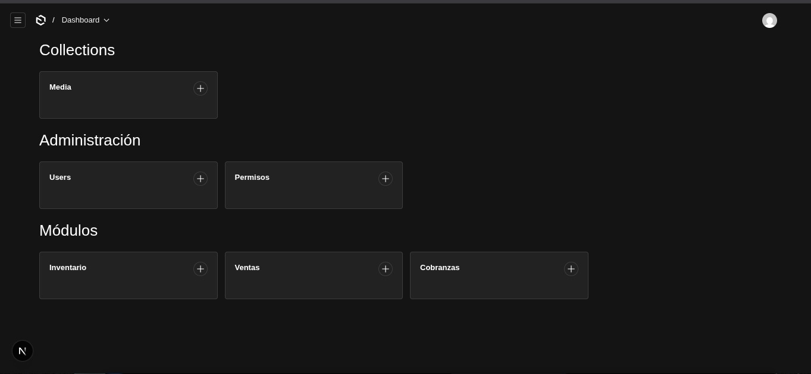
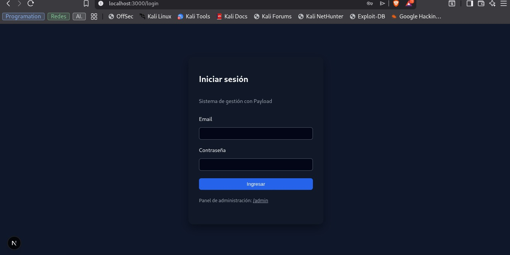
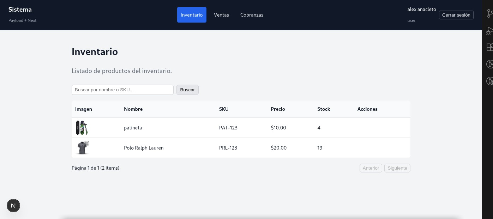
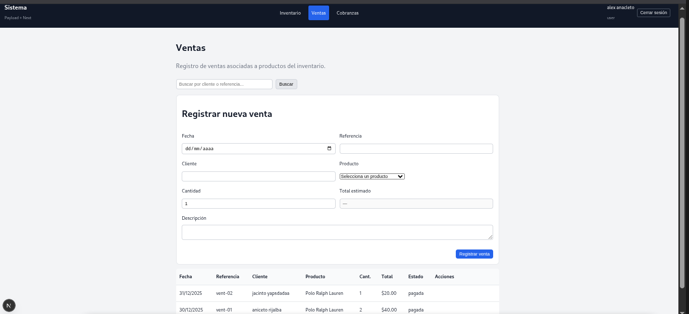
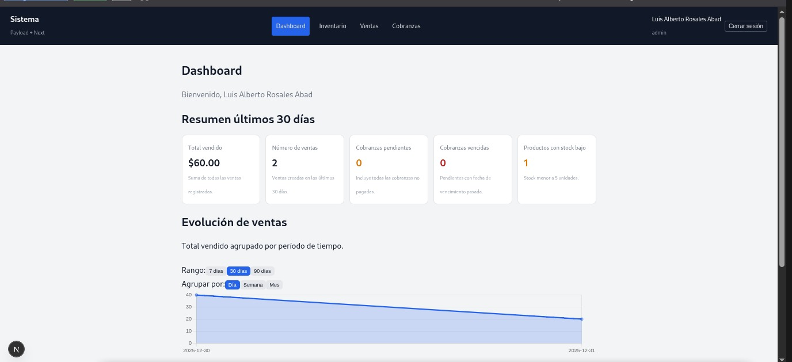

<!DOCTYPE html>
<html lang="es">
<head>
  <meta charset="UTF-8" />
  
  <meta name="viewport" content="width=device-width, initial-scale=1" />
  
</head>
<body>

  <h1>Sistema de Gestión con Payload CMS + Next.js</h1>
  

    Aplicación fullstack construida como prueba técnica para un puesto de desarrollador Fullstack.
    Integra <strong>Payload CMS 3</strong> como backend/headless CMS y <strong>Next.js 15 (App Router)</strong> como frontend,
    con control de acceso basado en roles y permisos por módulo.
  

  

  <h2>📌 Descripción General</h2>
  
El objetivo del proyecto es implementar un sistema con:

  <ul>
    <li><strong>2 roles de usuario</strong>: <code>admin</code> y <code>user</code>.</li>
    <li>
      <strong>Permisos granulares por módulo</strong>:
      <code>inventario</code>, <code>ventas</code>, <code>cobranzas</code>;
      y por operación: <code>canRead</code>, <code>canCreate</code>, <code>canUpdate</code>, <code>canDelete</code>.
    </li>
    <li>
      <strong>Panel de administración en Payload</strong> para gestionar:
      <ul>
        <li>Usuarios.</li>
        <li>Permisos por módulo.</li>
        <li>Inventario, Ventas y Cobranzas.</li>
      </ul>
    </li>
    <li>
      <strong>Frontend protegido</strong> (Next.js) que:
      <ul>
        <li>Solo muestra rutas y acciones permitidas según permisos del usuario.</li>
        <li>Diferencia la experiencia de <strong>administrador</strong> y <strong>usuario final</strong>.</li>
        <li>Gestiona inventario, ventas y cobranzas con actualización automática de stock.</li>
      </ul>
    </li>
  </ul>

  <h2>🏗️ Cómo se creó el proyecto</h2>

  <ol>
    <li>
      <strong>Inicialización con Payload + Next.js</strong>
      <pre><code>npx create-payload-app@latest prueba-fullstack
# Template: blank
# Database: MongoDB
# TypeScript: yes</code></pre>
    </li>
    <li>
      <strong>Configuración de base de datos</strong> 
      MongoDB Atlas como base de datos, configurada con
      <code>MONGODB_URI</code> en <code>.env</code>.
    </li>
    <li>
      <strong>Modelado en Payload (backend)</strong>
      <ul>
        <li>Extensión de colección <code>users</code> con campos <code>nombre</code> y <code>role</code>.</li>
        <li>Nueva colección <code>permissions</code> para permisos por módulo.</li>
        <li>Colecciones de negocio:
          <code>inventory-items</code>, <code>ventas</code>, <code>cobranzas</code>.</li>
        <li>Lógica de access control centralizada en <code>src/access/checkPermission.ts</code>.</li>
      </ul>
    </li>
    <li>
      <strong>Frontend Next.js (App Router)</strong>
      <ul>
        <li>Carpeta <code>(frontend)</code> para la app de negocio con rutas:
          <code>/login</code>, <code>/</code> (Dashboard admin),
          <code>/inventario</code>, <code>/ventas</code>, <code>/cobranzas</code>,
          <code>/unauthorized</code>.</li>
        <li>Contexto de autenticación <code>AuthContext</code> basado en API de Payload.</li>
      </ul>
    </li>
    <li>
      <strong>Dashboard admin + lógica de negocio</strong> 
      Gráfico lineal con <code>react-chartjs-2</code> y KPIs con tablas rápidas para stock bajo y cobranzas pendientes.
    </li>
  </ol>

  <h2>⚙️ Stack Tecnológico</h2>
  <ul>
    <li>
      <strong>Backend / CMS</strong>
      <ul>
        <li>Payload CMS 3</li>
        <li>MongoDB Atlas</li>
        <li>TypeScript</li>
      </ul>
    </li>
    <li>
      <strong>Frontend</strong>
      <ul>
        <li>Next.js 15 (App Router)</li>
        <li>React</li>
        <li>CSS plano</li>
      </ul>
    </li>
    <li>
      <strong>Otros</strong>
      <ul>
        <li>Chart.js + react-chartjs-2 (historial de ventas)</li>
        <li>Autenticación nativa de Payload (cookies/sesiones)</li>
      </ul>
    </li>
  </ul>

  <h2>🔐 Roles y Permisos</h2>

  <h3>Roles</h3>
  <ul>
    <li>
      <strong>Admin</strong>
      <ul>
        <li>Acceso total a todas las colecciones y módulos.</li>
        <li>Acceso al panel nativo de Payload en <code>/admin</code>.</li>
        <li>
          Dashboard (<code>/</code>) con:
          <ul>
            <li>KPIs (total vendido, nº ventas, cobranzas, stock bajo).</li>
            <li>Listas rápidas de stock bajo y cobranzas pendientes.</li>
            <li>Gráfico de historial de ventas.</li>
            <li>Resumen de permisos por módulo.</li>
          </ul>
        </li>
      </ul>
    </li>
    <li>
      <strong>User</strong>
      <ul>
        <li>Acceso restringido por documento en <code>permissions</code>.</li>
        <li>No ve el Dashboard (se redirige a <code>/inventario</code> al iniciar sesión).</li>
        <li>
          Solo ve en el menú los módulos donde <code>canRead = true</code>:
          inventario, ventas y/o cobranzas.
        </li>
      </ul>
    </li>
  </ul>

  <h3>Permisos por módulo</h3>
  
Colección <code>permissions</code>:

  <ul>
    <li>Campo <code>user</code>: relación 1:1 con <code>users</code> (único).</li>
    <li>Para cada módulo (<code>inventario</code>, <code>ventas</code>, <code>cobranzas</code>):
      <code>canRead</code>, <code>canCreate</code>, <code>canUpdate</code>, <code>canDelete</code>.</li>
    <li>Solo <code>admin</code> puede gestionar esta colección.</li>
    <li>Usuarios <code>user</code> no ven esta colección en el admin.</li>
  </ul>

  <h3>Access Control en Payload</h3>
  
En cada colección de módulo se utiliza:

  <pre><code>access: {
  read: checkModuleAccess('inventario', 'canRead'),
  create: checkModuleAccess('inventario', 'canCreate'),
  update: checkModuleAccess('inventario', 'canUpdate'),
  delete: checkModuleAccess('inventario', 'canDelete'),
}</code></pre>
  

    La función <code>checkModuleAccess</code> hace:
  

  <ol>
    <li>Si el usuario es <code>admin</code>, permite todo.</li>
    <li>Si es <code>user</code>, busca su documento en <code>permissions</code> y evalúa
      el flag del módulo/acción.</li>
  </ol>

  <h2>🗂️ Modelado de Datos</h2>

  <h3><code>users</code></h3>
  <ul>
    <li><code>email</code> (auth nativa)</li>
    <li><code>password</code> (auth nativa)</li>
    <li><code>nombre: string</code></li>
    <li><code>role: 'admin' | 'user'</code></li>
  </ul>

  <h3><code>permissions</code></h3>
  <ul>
    <li><code>user: relationship -&gt; users</code> (único)</li>
    <li><code>inventario: { canRead, canCreate, canUpdate, canDelete }</code></li>
    <li><code>ventas: { canRead, canCreate, canUpdate, canDelete }</code></li>
    <li><code>cobranzas: { canRead, canCreate, canUpdate, canDelete }</code></li>
  </ul>

  <h3><code>inventory-items</code></h3>
  <ul>
    <li><code>nombre: string</code></li>
    <li><code>sku: string</code> (único)</li>
    <li><code>precio: number</code></li>
    <li><code>stock: number</code></li>
    <li><code>descripcion: string</code> (opcional)</li>
    <li><code>imagen: string</code> (URL opcional)</li>
    <li><code>activo: boolean</code></li>
  </ul>

  <h3><code>ventas</code></h3>
  <ul>
    <li><code>fecha: date</code></li>
    <li><code>referencia: string</code></li>
    <li><code>cliente: string</code></li>
    <li><code>producto: relationship -&gt; inventory-items</code></li>
    <li><code>cantidad: number</code></li>
    <li><code>total: number</code> (calculado automáticamente)</li>
    <li><code>estado: 'pendiente' | 'pagada' | 'cancelada'</code></li>
    <li><code>descripcion: string</code> (opcional)</li>
  </ul>
  
<strong>Lógica de stock en ventas:</strong>

  <ul>
    <li><code>beforeChange</code>:
      <ul>
        <li>Calcula <code>total = precio * cantidad</code>.</li>
        <li>Valida que haya stock suficiente.</li>
      </ul>
    </li>
    <li><code>afterChange</code>:
      <ul>
        <li><code>create</code>: <code>stock -= cantidad</code>.</li>
        <li><code>update</code>: ajusta stock según la diferencia y cambios de producto.</li>
      </ul>
    </li>
    <li><code>afterDelete</code>:
      <ul>
        <li><code>stock += cantidad</code> (de la venta eliminada).</li>
      </ul>
    </li>
  </ul>

  <h3><code>cobranzas</code></h3>
  <ul>
    <li><code>fechaVencimiento: date</code></li>
    <li><code>referencia: string</code></li>
    <li><code>cliente: string</code></li>
    <li><code>monto: number</code></li>
    <li><code>estado: 'pendiente' | 'pagada' | 'vencida'</code></li>
    <li><code>descripcion: string</code> (opcional)</li>
  </ul>

  <h2>🧭 Rutas del Frontend</h2>

  <h3>Rutas públicas</h3>
  <ul>
    <li><code>/login</code> – pantalla de inicio de sesión.</li>
  </ul>

  <h3>Rutas protegidas</h3>
  <ul>
    <li>
      <code>/</code> – <strong>Dashboard</strong> (solo admin).
      <ul>
        <li>Users normales son redirigidos a <code>/inventario</code>.</li>
      </ul>
    </li>
    <li>
      <code>/inventario</code> – Listado de productos:
      <ul>
        <li>Búsqueda por nombre/SKU.</li>
        <li>Paginación.</li>
        <li>Miniaturas de imagen (si hay URL).</li>
      </ul>
    </li>
    <li><code>/inventario/nuevo</code> – Formulario de creación de producto.</li>
    <li><code>/inventario/[id]</code> – Edición de producto existente.</li>
    <li>
      <code>/ventas</code> – Módulo de ventas:
      <ul>
        <li>Selector de producto (desde inventario).</li>
        <li>Cantidad y descripción.</li>
        <li>Total calculado en backend y stock actualizado.</li>
        <li>Tabla de ventas con búsqueda, cambio de estado y eliminación.</li>
      </ul>
    </li>
    <li>
      <code>/cobranzas</code> – Módulo de cobranzas:
      <ul>
        <li>Registro de cobranzas con fecha de vencimiento.</li>
        <li>Búsqueda por cliente/referencia y tabla paginada.</li>
        <li>Acciones de cambio de estado y eliminación según permisos.</li>
      </ul>
    </li>
    <li><code>/unauthorized</code> – Página para accesos denegados.</li>
  </ul>

  <h3>Panel de administración Payload</h3>
  <ul>
    <li><code>/admin</code> – panel de Payload para administrar colecciones y configuración.</li>
  </ul>

  <h2>🧪 Flujo de Uso</h2>

  <h3>Administrador</h3>
  <ul>
    <li>Accede a <code>/admin</code> y crea usuarios con rol <code>user</code>.</li>
    <li>Asigna permisos por módulo en la colección <code>permissions</code>.</li>
    <li>Puede gestionar inventario, ventas y cobranzas.</li>
    <li>
      Desde <code>/</code> (Dashboard) ve:
      <ul>
        <li>KPIs (total vendido, número de ventas, cobranzas, stock bajo).</li>
        <li>Listas rápidas:
          <ul>
            <li>Top productos con stock bajo.</li>
            <li>Próximas cobranzas pendientes.</li>
          </ul>
        </li>
        <li>Gráfico de historial de ventas (filtrado por rango y agrupación).</li>
        <li>Resumen de permisos por módulo.</li>
      </ul>
    </li>
  </ul>

  <h3>Usuario normal (<code>user</code>)</h3>
  <ul>
    <li>Inicia sesión en <code>/login</code>.</li>
    <li>Es redirigido directamente a <code>/inventario</code>.</li>
    <li>Solo ve en el menú los módulos donde tiene <code>canRead = true</code>.</li>
    <li>Las acciones de crear/editar/eliminar se controlan por <code>canCreate</code>, <code>canUpdate</code>, <code>canDelete</code>.</li>
  </ul>

  <h2>🚀 Instalación y Ejecución</h2>

  <h3>Requisitos</h3>
  <ul>
    <li>Node.js 18+</li>
    <li>Cuenta en MongoDB Atlas (o Mongo local)</li>
  </ul>

  <h3>Variables de entorno</h3>
  
Crear un archivo <code>.env</code> en la raíz del proyecto con:

  <pre><code>MONGODB_URI=mongodb+srv://&lt;usuario&gt;:&lt;password&gt;@&lt;cluster&gt;.mongodb.net/prueba-fullstack?retryWrites=true&amp;w=majority
PAYLOAD_SECRET=un-secret-seguro</code></pre>

  <h3>Instalación</h3>
  <pre><code>npm install</code></pre>

  <h3>Desarrollo</h3>
  <pre><code>npm run dev</code></pre>
  <ul>
    <li>App: <a href="http://localhost:3000" target="_blank">http://localhost:3000</a></li>
    <li>Login: <a href="http://localhost:3000/login" target="_blank">http://localhost:3000/login</a></li>
    <li>Admin Payload: <a href="http://localhost:3000/admin" target="_blank">http://localhost:3000/admin</a></li>
  </ul>

  <h3>Build de producción (opcional)</h3>
  <pre><code>npm run build
npm run start</code></pre>

  <h2>📸 Capturas de Pantalla</h2>
  
Puedes guardar tus imágenes en una carpeta <code>docs/</code> y ajustar las rutas <code>src</code> según prefieras.

  

    
    
Figura 1. Panel de administración de Payload (colecciones y permisos).

  

  

    
    
Figura 2. Pantalla de Login del sistema.

  

  

    
    
Figura 3. Vista de usuario normal en el módulo de Inventario.

  

  

    
    
Figura 4. Vista de usuario normal en el módulo de Ventas.

  

  

    
    
Figura 5. Dashboard del administrador con KPIs, listas rápidas y gráfico de ventas.

  

  <h2>🔮 Mejoras Futuras</h2>
  <ul>
    <li>Integrar Cloudinary u otro proveedor para manejar imágenes como uploads en vez de URLs.</li>
    <li>Soportar ventas con múltiples productos (líneas de detalle) por cada venta.</li>
    <li>Agregar tests unitarios y end-to-end para flujos críticos (login, permisos, stock).</li>
    <li>Internacionalización (i18n) para soportar múltiples idiomas en la UI.</li>
  </ul>

  <h2>📝 Notas finales</h2>
  

    El foco principal de la prueba está en:
  

  <ul>
    <li>Diseño de modelos en Payload CMS.</li>
    <li>Autenticación nativa de Payload.</li>
    <li>Sistema de permisos por módulo (RBAC) tanto en backend como en frontend.</li>
    <li>Protección de rutas y componentes en Next.js.</li>
  </ul>
  

    Además, se implementaron mejoras adicionales, como actualización automática de stock
    al crear/editar/eliminar ventas y un Dashboard administrativo con KPIs, listas rápidas
    y gráfico de historial de ventas.
  

</body>
</html>
